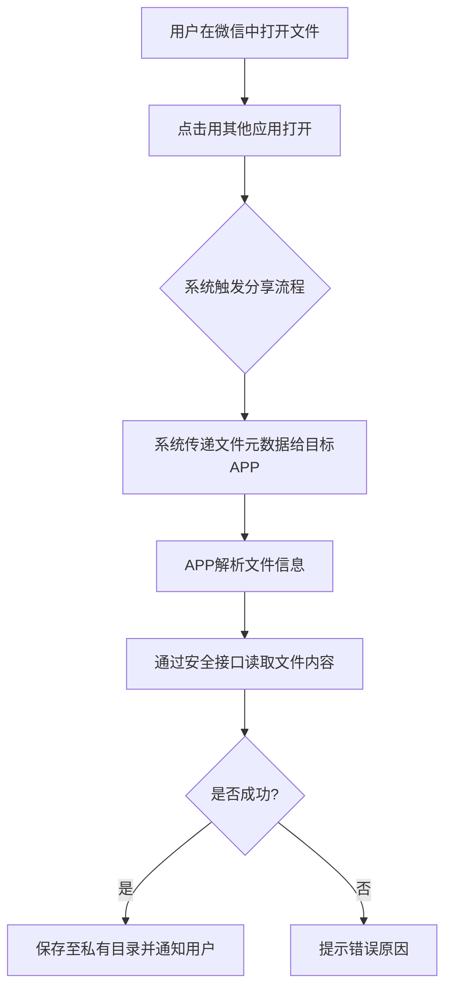

```mermaid
graph TD
    A[用户在微信中打开文件] --> B[点击用其他应用打开]
    B --> C{系统触发分享流程}
    C --> D[系统传递文件元数据给目标APP]
    D --> E[APP解析文件信息]
    E --> F[通过安全接口读取文件内容]
    F --> G{是否成功?}
    G -- 是 --> H[保存至私有目录并通知用户]
    G -- 否 --> I[提示错误原因]
```